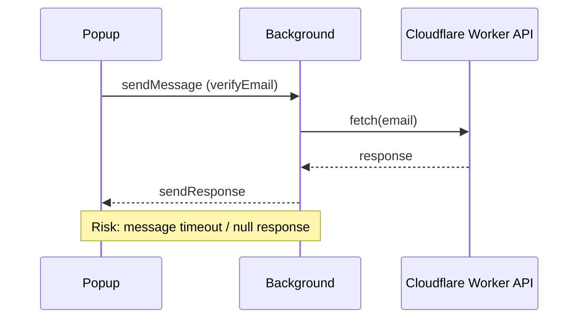

# Architecture Overview – Lead Generator Extension

**Last updated**: March 25, 2025

This document provides a high-level overview of the architectural structure of the **Lead Generator** Chrome Extension. It is intended for developers and maintainers who wish to understand how the extension is structured and how its core components interact.

## 1. Overview

The extension is designed to extract structured data (name, surname, job position, LinkedIn profile link, etc.) from **LinkedIn Sales Navigator** pages (`https://www.linkedin.com/sales/lead/*`, `https://www.linkedin.com/sales/company/*`) and **Linkedin** pages (`https://www.linkedin.com/company/*`) just on demand. It operates entirely in the client environment, with optional secure interactions with external APIs for translation and email validation.

The extension is composed of modular JavaScript files, grouped logically into directories. These files operate in two main environments:

- **Content Scripts**: Run in the context of LinkedIn Sales Navigator pages (`https://www.linkedin.com/sales/lead/*`, `https://www.linkedin.com/sales/company/*`) and Linkedin pages (`https://www.linkedin.com/company/*`).
- **Extension UI Scripts**: Power the popup interface, background logic, and user interactions.

## 2. Key Components

### 2.1 Content Scripts (`src/content-scripts`)

- Injected into `https://www.linkedin.com/sales/lead/*`, `https://www.linkedin.com/sales/company/*` pages.
- Responsible for extracting public data from the DOM of LinkedIn Sales Navigator via messaging.
- Examples: `lead.js`, `lead-experience.js`.

### 2.2 Extension Scripts (`src/scripts`)

Contain all logic related to the extension interface, state management, button behavior, drag-and-drop, and background communication.

#### ▸ `src/scripts/worker/`

- Contains `background.js`, used for tasks like validating email addresses through third-party APIs (e.g., Emailable).
- Runs as a background service worker.

#### ▸ `src/scripts/containers/data/`

Handles user-interaction logic related to core actions:

- `get-data.js` – Fetches and formats the data from the LinkedIn page when the "Get" button is clicked.
- `copy-data.js` – Copies the collected data to the clipboard.
- `drag-and-drop-data.js` – Handles reordering of elements in the popup via drag and drop.

### 2.3 Styles (`src/styles`)

- `main.css` defines styles for the popup interface and interactive components.

### 2.4 HTML Interface

- `index.html` is located at the root and serves as the popup's main container.

### 2.5 UI Architecture

The extension UI follows a lightweight SPA-like approach within the popup.

- The **left panel** is static and always visible
- The **right panel** is dynamic and controlled via a tab system

#### Tab System

- Implemented using a **dropdown selector**
- Tabs are rendered using a **show/hide pattern (no full re-render)**
- Current tabs:
  - **Actual Experience** (actual tab by default) – displays extracted company data
  - **Settings** – manages user preferences

This approach avoids unnecessary DOM re-creation and improves performance within the constrained popup environment.

## 3. Technologies Used

- **Vanilla JavaScript** – No front-end frameworks are used
- **Chrome Extension APIs** – Used for background workers, clipboard operations, and storage
- **OAuth2 (Google)** – Used for authenticated access to Google Translate API during translations
- **Chrome Storage API** – used to persist user preferences (e.g., drag & drop settings)

## 4. Third-Party Services

### 4.1 Emailable API

- Used for email verification.
- Accessed only via secure backend (Cloudflare Worker).
- No email address is validated on the client directly.

### 4.2 Google Cloud Translate API

- Optional.
- Used to translate non-English job titles into English.
- Requires Google account authentication via OAuth2.
- Translation is performed client-side during the session.

## 5. Security & Privacy Considerations

- **No personal or extracted profile data is stored**
- **User preferences (UI settings)** are stored locally using Chrome Storage
- **No cookies are set or read**.
- **Clipboard is used only temporarily**, initiated manually by the user.
- **OAuth2 tokens** for Google Translate are handled by the Chrome Identity API and never stored.
- **All secret keys (Emailable API)** are stored only in the Cloudflare Worker.

For more, see [PRIVACY_POLICY.md](../PRIVACY_POLICY.md)

## 6. Data Flow Summary

1. User opens the popup.
2. On pressing "Get", content scripts extract data from the current `https://www.linkedin.com/sales/lead/*` LinkedIn Sales Navigator page and `https://www.linkedin.com/sales/company/*`, `https://www.linkedin.com/company/*` in the background mode.
3. Data is returned and displayed in the popup.
4. The user can:
   - Copy the data via the "Copy" button.
   - Rearrange data using drag-and-drop.
   - Translate job title via the Google Translate API (if logged in via Google OAuth2).
   - Trigger email generation:
     - Extension sends company domain to backend.
     - Backend validates generated emails via Emailable.
     - Valid result is returned and inserted into form and clipboard.
   - Validate email separately via Emailable.
5. No data is stored on servers; data only exists temporarily in memory or clipboard.
6. The user can configure extension behavior via the Settings tab:
   - Toggle drag-and-drop functionality
   - Preferences are persisted using Chrome Storage API

## 7. Permissions Summary

```json
"permissions": [
  "activeTab",
  "scripting",
  "identity",
  "tabs",
  "storage"
],
"host_permissions": [
  "https://www.linkedin.com/sales/lead/*",
  "https://www.linkedin.com/sales/company/*",
  "https://www.linkedin.com/company/*",
  "https://my-apikey-worker.vitalij-musko.workers.dev"
]
```

## 8. Extensibility Notes

The modular directory structure allows easy scaling:

- New button logic can be added inside `containers/data/`.
- Background tasks can be isolated under `worker/`.
- Any new content scripts should go under `content-scripts/`.
- The tab-based UI allows easy addition of new functional modules (e.g., Filters, Logs, Analytics)
- New tabs can be added without restructuring the core layout

---

## 9. Background Script Usage Strategy

In the current architecture of the extension, the `background.js` (service worker) is **used selectively** and only for scenarios where it provides clear technical value.

### 9.1 When Background Script Is Used

The background service worker is responsible for:

- Handling tasks that require **Chrome Extension APIs**, such as:
  - tab interaction (`tabs`)
  - script injection (`scripting`)
- Executing **centralized logic** that must persist independently of the popup lifecycle
- Acting as a **secure intermediary** when sensitive data (e.g., API keys) must not be exposed to the client

---

### 9.2 When Background Script Is NOT Used

For simple network operations (e.g., HTTP requests to external APIs), the extension **avoids using the background script as a proxy layer**.

Instead, such requests are executed **directly from the popup (UI layer)** when the following conditions are met:

- The request does not require Chrome-specific APIs
- No sensitive data (e.g., API keys) is exposed in the client
- The external service is already protected via a secure backend (e.g., Cloudflare Worker)

---

### 9.3 Rationale

Avoiding the background script in these cases improves both **stability** and **performance**.

#### ❗ Limitations of Chrome Messaging

Communication between the popup and background relies on `chrome.runtime.sendMessage`, which has an **implicit timeout and lifecycle constraints**:

- If an asynchronous operation (e.g., `fetch`) takes too long  
  → the message channel may close prematurely  
  → the popup receives a `null` response  
- This behavior is especially common under network latency or high load

#### ⚠️ Service Worker Lifecycle (Manifest V3)

In Manifest V3, the background script runs as a **service worker**, which:

- Can be **terminated at any time**
- Does not guarantee completion of long-running async operations
- May interrupt pending requests or responses

---

### 9.4 Architecture Comparison

#### ❌ Legacy (Problematic) Approach



---

### 9.5 Benefits of Direct Fetch from Popup

Using direct fetch calls from the popup provides:
- Reliable async behavior (async/await works without interruption)
- No dependency on message passing or channel timeouts
- Lower latency (no intermediate layer)
- Simpler and more maintainable code
- Improved user experience (fewer edge-case failures)

---

### 9.6 Summary

The background script is **not a default communication layer**, but a **specialized tool**.
> **Note:** It should only be used when its capabilities are required. Otherwise, introducing it into the request flow may lead to unnecessary complexity, reduced reliability, and degraded user experience.

## 10. Related Documents

- [`README.md`](../README.md) – Installation and usage instructions.
- [`PRIVACY_POLICY.md`](../PRIVACY_POLICY.md) – Explains what data is collected and how it is handled.
- [`CHANGELOG.md`](../CHANGELOG.md) – List of version changes.

