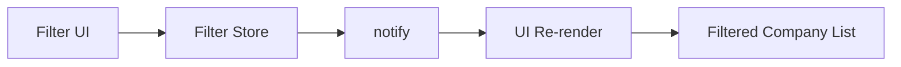
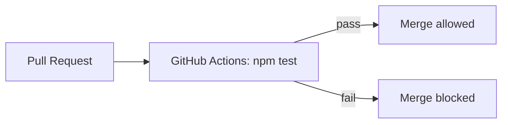
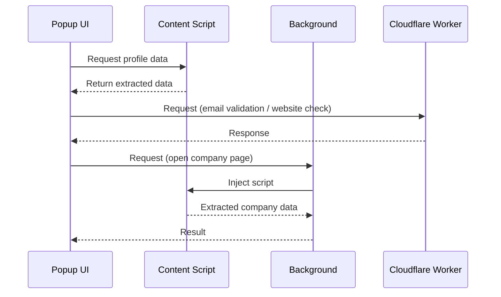
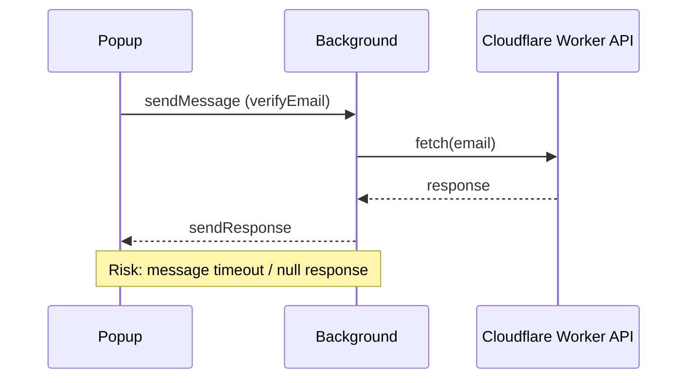

# Architecture Overview – Lead Generator Extension

**Last updated**: August 14, 2026

This document provides a high-level overview of the architectural structure of the **Lead Generator** browser extension (Chrome, Edge, Firefox). It is intended for developers and maintainers who wish to understand how the extension is structured and how its core components interact.

## 1. Overview

The extension is designed to extract structured data (name, surname, job position, LinkedIn profile link, etc.) from:

- **LinkedIn Sales Navigator pages** (`https://www.linkedin.com/sales/lead/*`)
- **LinkedIn company pages** (`https://www.linkedin.com/company/*`)

The extension operates **only within LinkedIn domains** (`https://www.linkedin.com/*`).

Due to modern browser security restrictions (CORS), all external network requests are performed via a **secure backend (Cloudflare Worker)**.

The extension is composed of modular JavaScript files, grouped logically into directories. These files operate in two main environments:

- **Content Scripts** – run inside LinkedIn pages
- **Extension UI Scripts (Popup)** – handle user interaction and UI logic

## 2. Key Components

### 2.1 Content Scripts (`src/content-scripts`)

- Injected into:
  - `https://www.linkedin.com/sales/lead/*`
  - `https://www.linkedin.com/company/*`
- Responsible for extracting public data from the DOM via messaging
- Do **not perform external network requests**
- Examples: `lead.js`, `lead-experience.js`

### 2.2 Extension Scripts (`src/scripts`)

Contain all logic related to:

- UI rendering
- State management
- User interaction
- Direct communication with backend services

#### ▸ `src/scripts/worker/` (background.js)

Used **only when necessary** for:

- Chrome APIs:
  - `tabs`
  - `scripting`
  - `action` (icon override)
- Managing background tab processing (e.g., opening company pages)
- Coordinating data extraction from secondary pages
- On `onInstalled` / `onStartup`: if `manifest.environment === "local"`, renders the toolbar icon in greyscale via `OffscreenCanvas` and `chrome.action.setIcon()` to visually distinguish development builds from production
🚫 **Not used for external HTTP requests**

#### ▸ `src/scripts/containers/data/`

Handles user-interaction logic related to core actions:

- `extract-data.js` – fetches and formats the data from the LinkedIn pages when the "Extract" button is clicked
- `open-company-linkedin.js` – handles the LinkedIn button next to the Company Name field; opens the selected company's LinkedIn page in a new tab; button is enabled/disabled reactively based on whether the selected company has a LinkedIn URL
- `storage-actions.js` – manages local storage of leads:
  - **Save** - saves current left-panel lead data; requires at least one field to be non-empty; disabled when the configured max-saved-leads limit is reached; when email is present it acts as a unique key; when email is empty, the full combination of all other fields must be unique
  - **Get** - clipboard copy in tab-separated format with live counter, progress bar fill relative to the configured limit; column order reflects the current left-panel field order at the time of copying
  - **Clean** - full reset; disabled when no leads are saved; shows an in-page confirmation dialog before clearing
  - Subscribes to `max-leads-store.js` so the counter, progress bar, and Save button state react immediately when the max-saved-leads setting changes

### 2.3 Filters (`src/scripts/filters`)

The filtering system is implemented as a **client-side module** responsible for dynamically filtering extracted company data within the popup UI.

#### Key Characteristics

- Fully **client-side** (no backend involvement)
- Works on already extracted data (no additional DOM queries)
- Designed as a **reactive system** using a lightweight state manager

#### Structure

- `filter-store.js` – centralized state management
- `company-location.js` – handles location filtering UI and logic
- `company-size.js` – handles size filtering UI and logic

#### UI Behavior

- Multi-select dropdown with **tag-based selection**
- Selected values are displayed as removable tags
- Removing a tag reintroduces the option into the dropdown
- Displays **"No results"** message when all companies are hidden by active filters or no data was extracted

#### Filtering Logic

- Supports **combined filtering (AND logic)**
  - Example:
    - Location = "Germany"
    - Size = "51-200"
      → Only items matching both conditions are displayed

#### State Management

The filtering system is powered by a **custom mini state manager**, which provides:

- Centralized state (`state`)
- Subscription mechanism (`subscribe`)
- Reactive updates (`notify`)

This allows UI components to automatically re-render when filters change.

#### Persistence

- Filter state is persisted using **Chrome Storage API**
- Restored on extension load



### 2.4 Backend (Cloudflare Worker)

A critical part of the architecture.

Handles:

- Email validation (via Emailable API)
- Website availability checks
- Cross-origin requests (CORS-safe proxy)

All external requests go through: [Cloudflare Worker](https://developers.cloudflare.com/workers/)

### 2.5 Styles (`src/styles`)

The popup styles are split into focused files by domain:

- `main.css` — global element resets (body, inputs, button base, links) and main layout containers
- `buttons.css` — button groups, variants (secondary, progress), and get-counter widget
- `form-fields.css` — draggable field blocks, icon buttons, alert toasts, confirm dialog, and validation states
- `company-card.css` — accordion company card components, loading states, and website/domain editor
- `tabs.css` — tab selector dropdown, tab show/hide, and custom scrollbar
- `filters.css` — multi-select tags, single-select dropdown, and option styles

### 2.6 HTML Interface

- `index.html` is located at the root and serves as the popup's main container

### 2.7 UI Architecture

The extension UI follows a lightweight SPA-like approach within the popup.

- The **left panel** is static and always visible
- The **right panel** is dynamic and controlled via a tab system

#### Tab System

- Implemented using a **dropdown selector**
- Tabs are rendered using a **show/hide pattern (no full re-render)**
- Current tabs:
  - **Actual Experience** (default) – displays extracted company data
  - **Filters** – allows filtering extracted company data
  - **Settings** – manages user preferences

This approach avoids unnecessary DOM re-creation and improves performance within the constrained popup environment.

#### Actual Experience Tab – Accordion Pattern

The Actual Experience tab (`src/scripts/containers/experience/`) uses a CSS-class-driven accordion:

- Each company is rendered as a `.company-item` element containing:
  - `.company-header` – always visible; holds company name, job position, expand arrow, and refresh button
  - `.company-details` – hidden by default; revealed by adding `.active` to the parent `.company-item`; contains website, industry, location, company size, and members count
- Only one `.company-item` can hold `.active` at a time; clicking a header removes `.active` from all siblings and adds it to the clicked item
- **Company data loading** is handled by `company-details.js`:
  - Uses a `companyDetailsCache` Map (keyed by company URL) to avoid redundant network fetches
  - Marks a `.company-website` block with `data-initialized="true"` once data is loaded to skip re-fetching on re-expand
- **Refresh button (↻)** in the active header: calls `refreshCompanyDetails(item)`, which clears the cache entry, resets `data-initialized`, restores original attribute values, and re-runs the fetch pipeline

### 2.8 Local Storage (`chrome.storage.local`)

Used for saved leads (key: `saved_leads`). Holds a list of lead objects (name, surname, job position, link, email, company name, country, industry, company id), capped at a user-configurable limit (default 99, adjustable up to 9999 via the **Max saved leads** setting). The email field acts as a unique key — duplicates are rejected at save time. The Get button copies all leads to the clipboard as tab-separated rows for direct paste into spreadsheet applications; when the **Store company id** setting is enabled, the company id is appended as an extra last column.

#### Max Saved Leads Setting

- `max-leads-store.js` (`src/scripts/store/`) — pub/sub state manager for the configured limit (`maxSavedLeads` key in `chrome.storage.sync`, default 99, hard cap 9999), mirroring `filter-store.js`'s pattern (`state`, `subscribe`, `notify`)
- `max-saved-leads.js` (`src/scripts/containers/settings/`) — wires the "Max saved leads" numeric field in the Settings tab:
  - Strips non-digit characters as the user types, capped to 4 characters
  - On blur, validates the value is an integer between 1 and 9999; invalid input is rejected and reverted, with an alert shown
  - If the new limit is lower than the current number of saved leads, shows a confirmation dialog before proceeding; on confirmation, the oldest leads (first added, i.e. the start of the `saved_leads` array) are removed to fit the new limit; declining leaves both the stored leads and the setting unchanged
  - Valid changes are persisted automatically on blur — no explicit save action required
- `storage-actions.js` subscribes to `max-leads-store.js` to keep the Save button state, leads counter, and progress bar in sync whenever the limit changes

Company id is derived from the active company's LinkedIn link (`data-company-id`, extracted via `extractCompanyId` in `src/utils/company-id.js`) and held in a hidden `#company-id` field, populated whenever a company header is clicked (mirrors how country/industry are populated). It is not part of the draggable field order — it is always appended after it.

### 2.9 Persistence Strategy

The extension uses Chrome Storage APIs for lightweight client-side persistence:

- `chrome.storage.sync`
  - User preferences
  - UI settings (drag-and-drop toggle, remember field order toggle, transliteration toggle, country-by-default toggle and selected country, store-company-id toggle, max-saved-leads limit)
  - Field order (`fieldOrder` key — array of input IDs representing left-panel field sequence)
  - Filter state

- `chrome.storage.local`
  - Saved leads
  - Temporary structured lead datasets

No server-side persistence is used.
All stored data remains on the user's device.

## 3. Technologies Used

- **Vanilla JavaScript** – no front-end frameworks are used
- **WebExtensions API (MV3)** – used for background workers, clipboard operations, and storage; compatible with Chrome, Edge, and Firefox 128+ via the `chrome.*` namespace
- **Google Cloud Translate API** – accessed via the Cloudflare Worker backend using a server-side API key
- **Chrome Storage API** – used to persist user preferences (e.g., drag-and-drop, field order, transliteration settings), filters, and leads; `storage.sync` syncs via Google account on Chrome/Edge and via Firefox Sync on Firefox
- **Cloudflare Workers (Backend layer)** - used for handling external requests and cross-origin operations

## 4. Third-Party Services

### 4.1 Emailable API

- Used for email verification
- Accessed only via secure backend (Cloudflare Worker)

### 4.2 Google Cloud Translate API

- Optional
- Used to translate non-English job titles into English
- Accessed via the Cloudflare Worker backend using a server-side API key — no client-side authentication required
- Works identically in Chrome, Edge, Firefox

## 5. Security & Privacy Considerations

- Extracted lead data is not stored automatically
- Leads may optionally be saved locally by the user using the Save feature (`chrome.storage.local`)
- No extracted or saved data is transmitted to external servers
- **User preferences (UI settings)** are stored locally using Chrome Storage API
- **No cookies are set or read**
- **Clipboard is used only temporarily**, initiated manually by the user
- **All secret keys (Google Translate API, Emailable API)** are stored only in the Cloudflare Worker — never exposed to the client

For more, see [PRIVACY_POLICY.md](../PRIVACY_POLICY.md)

## 5. Project Structure

```
.github/
 └── workflows/
      └── test.yml                      (GitHub Actions CI — runs npm test on push/PR to master)
src/
 ├── constants/                        (shared config and data)
 │    ├── company-sizes.js             (COMPANY_SIZES array)
 │    ├── config.js                    (DEFAULT_MAX_SAVED_LEADS, MAX_SAVED_LEADS_LIMIT, getWorkerUrl)
 │    ├── countries.js                 (EUROPEAN_COUNTRIES array)
 │    └── email-templates.js           (emailTemplates array)
 ├── content-scripts/
 │    ├── actions/
 │    │    └── extract-data.js         (message listener, data orchestrator)
 │    ├── common/
 │    │    └── constants.js            (company status suffixes, Dutch surnames)
 │    ├── linkedin-pages/
 │    │    └── company.js              (LinkedIn company About page scraper)
 │    └── sales-navigator-pages/
 │         └── lead/
 │              ├── lead.js            (personal data extraction)
 │              └── lead-experience.js (job experience extraction)
 ├── scripts/
 │    ├── components/
 │    │    └── multi-select-filter.js  (reusable multi-select dropdown)
 │    ├── containers/
 │    │    ├── data/
 │    │    │    ├── extract-data.js    (Extract button handler)
 │    │    │    ├── open-company-linkedin.js
 │    │    │    └── storage-actions.js (Save/Get/Clean)
 │    │    ├── experience/
 │    │    │    ├── actual-experience.js (company list renderer)
 │    │    │    └── company-details.js   (orchestration and rendering)
 │    │    ├── filters/
 │    │    │    ├── company-location.js
 │    │    │    ├── company-size.js
 │    │    │    └── filters-engine.js
 │    │    ├── navigation/
 │    │    │    └── tab-selector.js
 │    │    └── settings/
 │    │         ├── country-by-default.js
 │    │         ├── drag-and-drop.js
 │    │         ├── field-order.js
 │    │         ├── max-saved-leads.js
 │    │         ├── store-company-id.js
 │    │         └── transliteration.js
 │    ├── features/
 │    │    ├── drag-and-drop.js          (drag-and-drop field reordering)
 │    │    └── website-domain-editor.js  (inline contentEditable domain editing)
 │    ├── helper/
 │    │    ├── dom-action.js            (copy, validation, text effects)
 │    │    ├── dom-helper.js            (DOM getter functions)
 │    │    └── general.js              (version display)
 │    ├── output/
 │    │    ├── alert.js                (toast notifications)
 │    │    └── confirm.js              (in-page confirmation dialog)
 │    ├── services/
 │    │    ├── company-data.js         (company fetch, cache, domain utils)
 │    │    ├── email-generator.js      (email address generation logic)
 │    │    ├── email-validator.js      (Cloudflare Worker email validation)
 │    │    ├── email.js                (email UI handlers, cache)
 │    │    ├── translation.js          (Google Translate integration)
 │    │    └── transliteration.js      (Cyrillic/German name handling)
 │    ├── store/
 │    │    ├── filter-store.js         (pub/sub state manager)
 │    │    └── max-leads-store.js      (pub/sub state manager for max saved leads limit)
 │    ├── utils/
 │    │    └── chrome-storage.js       (syncGet, syncSet, localGet, localSet)
 │    └── worker/
 │         └── background.js           (service worker)
 ├── styles/
 │    ├── main.css          (global element resets and layout)
 │    ├── buttons.css       (button groups and variants)
 │    ├── form-fields.css   (draggable fields, alert, confirm dialog)
 │    ├── company-card.css  (accordion card, loading states, domain editor)
 │    ├── tabs.css          (tab selector, tabs, scrollbar)
 │    └── filters.css       (multi-select, tags, dropdown)
 └── utils/
      ├── company-id.js                (extractCompanyId — pure, tested)
      ├── email-utils.js               (prepareEmailName, collectEmails — pure, tested)
      ├── filter-utils.js              (matchesFilter — pure, tested)
      ├── lead-utils.js                (isDuplicate — pure, tested)
      └── mutation-observer.js         (waitForElement utilities for content scripts)
```

## 6. Testing & CI/CD

### Running tests locally

```
npm install   # once after cloning
npm test
```

The project uses **Jest** with native ES module support.

### Scope

Only **pure functions** (no DOM, no Chrome APIs, no `fetch`) are unit-tested. They are extracted into `src/utils/` so they can be imported in Node.js without mocking the browser environment.

| Test file | Module under test | What it covers |
|---|---|---|
| `tests/email-utils.test.js` | `src/utils/email-utils.js` | `prepareEmailName`, `collectEmails` |
| `tests/email-validator.test.js` | `src/scripts/services/email-validator.js` | `parseVerifyResult` |
| `tests/company-data.test.js` | `src/scripts/services/company-data.js` | `isValidDomain`, `getHostName`, `formatCompanySize` |
| `tests/company-location.test.js` | `src/scripts/containers/filters/company-location.js` | `extractCountry` |
| `tests/lead-utils.test.js` | `src/utils/lead-utils.js` | `isDuplicate` |
| `tests/company-id.test.js` | `src/utils/company-id.js` | `extractCompanyId` |
| `tests/transliteration.test.js` | `src/scripts/services/transliteration.js` | `hasGermanLetters`, `transliterateGermanLetters` |
| `tests/filter-utils.test.js` | `src/utils/filter-utils.js` | `matchesFilter` — case-insensitive substring matching, multi-filter OR logic, edge cases |
| `tests/filter-store.test.js` | `src/scripts/store/filter-store.js` | `subscribe`/unsubscribe, `setFilter` (state, storage, listeners), `loadFilters`; Chrome Storage mocked via `jest.unstable_mockModule` |
| `tests/max-leads-store.test.js` | `src/scripts/store/max-leads-store.js` | `subscribe`/unsubscribe, `setMaxSavedLeads` (state, storage, listeners), `loadMaxSavedLeads` (default fallback); Chrome Storage mocked via `jest.unstable_mockModule` |

### What is not tested

Content scripts, DOM manipulation, and `fetch`-based services are not unit-tested — they depend on a real browser environment and are verified manually by loading the extension.

Modules whose only browser dependency is `chrome.storage` (no DOM, no `chrome.tabs`/`scripting`/`runtime`) can be tested by mocking the storage wrapper with `jest.unstable_mockModule` before dynamically importing the module under test (see `tests/filter-store.test.js`).

### CI/CD pipeline

The workflow is defined in `.github/workflows/test.yml` and runs on **GitHub Actions**.

**Triggers:**
- Every push to `master`
- Every pull request targeting `master`

**Steps:** checkout → Node.js 22 setup → `npm ci` → `npm test`

**Branch protection:** the `master` branch has a classic protection rule that requires the `test` status check to pass before a PR can be merged. Direct pushes to `master` without a passing check are also blocked.



## 7. Data Flow Summary

1. User opens the popup

2. On pressing "Extract", content scripts extract data from the current `https://www.linkedin.com/sales/lead/*` LinkedIn Sales Navigator page; additional company data is fetched from `https://www.linkedin.com/company/*` in the background

3. Data is returned and displayed in the popup

4. The user can:

- Save current lead data locally
- Copy all saved leads to clipboard in spreadsheet-compatible format
- Clean all locally saved leads
- Rearrange data using drag-and-drop
- Translate job title via the Google Translate API
- Trigger email generation:
  - Extension sends company domain to backend
  - Backend validates generated emails via Emailable
  - Valid result is returned and inserted into form and clipboard
- Validate email separately via Emailable

5. No data is stored on servers; data only exists temporarily in memory or clipboard

6. The user can configure extension behavior via the Settings tab:

- Toggle drag-and-drop functionality
- Toggle remember field order (saves and restores left-panel field sequence)
- Toggle individual's names transliteration
- Preferences are persisted using Chrome Storage API
- Apply filters:
  - Filter state is updated via the filter store
  - UI automatically re-renders based on active filters
  - Filtering is performed entirely in memory (no additional requests)



## 8. Permissions Summary

```json
"permissions": [
  "activeTab",
  "scripting",
  "tabs",
  "storage"
],
"host_permissions": [
  "https://www.linkedin.com/sales/lead/*",
  "https://www.linkedin.com/company/*",
  "https://lead-generator-backend-worker.vitalij-musko.workers.dev"
]
```

## 9. Extensibility Notes

The modular directory structure allows easy scaling:

- New button logic can be added inside `containers/data/`
- New standalone UI features (e.g. inline editors, pickers) belong in `features/`
- New shared data or configuration belongs in `constants/`
- Background tasks can be isolated under `worker/`
- Any new content scripts should go under `content-scripts/`
- The tab-based UI allows easy addition of new functional modules
- New tabs can be added without restructuring the core layout
- New filters can be added inside `filters/` using the same pattern:
  - Thin wrapper calling `initMultiSelectFilter` from `components/multi-select-filter.js`
  - Add the new filter key to `filter-store.js` state and to `filters-engine.js`
- The filter system is designed to support scalable multi-criteria filtering

## 10. Background Script Usage Strategy

In the current architecture of the extension, the `background.js` (service worker) is **used selectively** and only for scenarios where it provides clear technical value.

### 9.1 When Background Script Is Used

The background service worker is responsible for:

- Handling tasks that require **Chrome Extension APIs**, such as:
  - tab interaction (`tabs`)
  - script injection (`scripting`)
- Executing **centralized logic** that must persist independently of the popup lifecycle

### 9.2 When Background Script Is NOT Used

For simple network operations (e.g., HTTP requests to external APIs), the extension **avoids using the background script as a proxy layer**.

Instead, such requests are executed **directly from the popup (UI layer)** when the following conditions are met:

- The request does not require Chrome-specific APIs
- No sensitive data (e.g., API keys) is exposed in the client
- The external service is already protected via a secure backend (e.g., Cloudflare Worker)

### 9.3 Rationale

Avoiding the background script in these cases improves both **stability** and **performance**.

#### ❗ Limitations of Chrome Messaging

Communication between the popup and background relies on `chrome.runtime.sendMessage`, which has an **implicit timeout and lifecycle constraints**:

- If an asynchronous operation (e.g., `fetch`) takes too long
  - the message channel may close prematurely
  - the popup receives a `null` response
- This behavior is especially common under network latency or high load

#### ⚠️ Service Worker Lifecycle (Manifest V3)

In Manifest V3, the background script runs as a **service worker**, which:

- Can be **terminated at any time**
- Does not guarantee completion of long-running async operations
- May interrupt pending requests or responses

### 9.4 Architecture Comparison

#### ❌ Legacy (Problematic) Approach



### 9.5 Benefits of Direct Fetch from Popup

Using direct fetch calls from the popup provides:

- Reliable async behavior (async/await works without interruption)
- No dependency on message passing or channel timeouts
- Lower latency (no intermediate layer)
- Simpler and more maintainable code
- Improved user experience (fewer edge-case failures)

### 9.6 Request Stability — Per-Session Task Model

The background service worker tracks company-data fetch tasks using a **per-session model** to eliminate race conditions and support parallel usage across multiple browser windows.

#### How it works

- When a popup opens, `company-data.js` generates a `popupSessionId` (`crypto.randomUUID()`) that is stable for the lifetime of that popup window
- Every `fetchLinkedinCompanyPage` message carries this `sessionId`
- The background maintains a `sessionTasks` map (`Map<sessionId, { tabId, resolve, timeoutId, ... }>`) — at most one in-flight tab per popup window
- When a new request arrives for a session that already has a tab in flight (e.g., the user switched companies), the old tab is immediately closed and its promise resolved with `null` before the new tab is created

#### Parallel window support

Because each window has a distinct `sessionId`, sessions are fully isolated: cancelling an in-flight request in window A has no effect on window B's tab.

#### Timeout strategy

Two timeouts are used in combination:

| Timeout | Starts from | Duration | Purpose |
|---|---|---|---|
| Post-load | `status: complete` | 10 s | Gives the content script a full budget after the LinkedIn SPA finishes rendering |
| Fallback | Tab creation | 30 s | Guards against `complete` never firing (e.g., blocked or crashed tab) |

Previously the only timeout started at tab creation; on a slow connection the SPA could take several seconds to reach `complete`, leaving the content script fewer than 10 s to find the DOM element.

#### Listener registration

`chrome.tabs.onUpdated` and `chrome.runtime.onMessage` handlers are registered **once at service-worker startup** (module level), not inside each Promise constructor. Listeners route by looking up the sender's `tabId` in `sessionTasks`. This eliminates listener accumulation that occurred under rapid company switching in earlier versions.

### 9.7 Summary

The background script is **not a default communication layer**, but a **specialized tool**.

> It should only be used when its capabilities are required. Otherwise, introducing it into the request flow may lead to unnecessary complexity, reduced reliability, and degraded user experience.

## 11. Related Documents

- [`README.md`](../README.md) – Installation and usage instructions
- [`PRIVACY_POLICY.md`](../PRIVACY_POLICY.md) – Explains what data is collected and how it is handled
- [`CHANGELOG.md`](../CHANGELOG.md) – List of version changes
