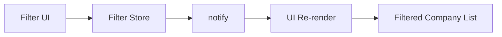
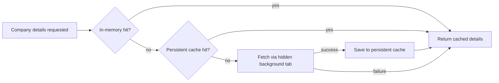
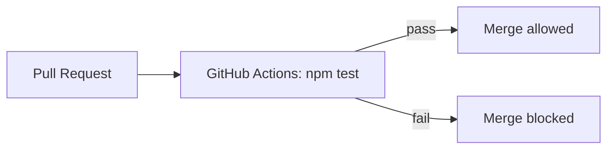
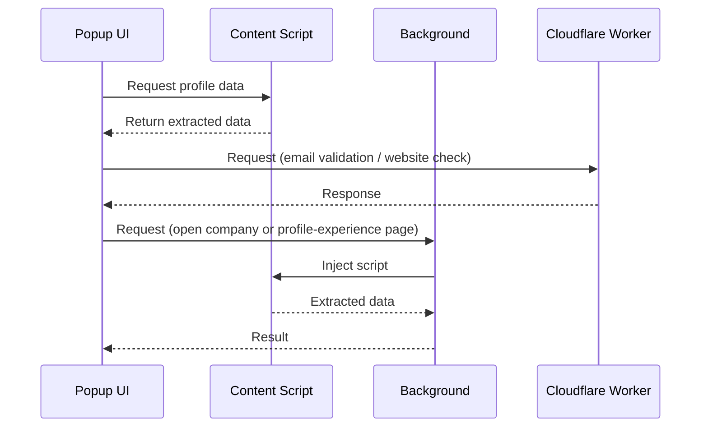

# Architecture Overview – Lead Generator Extension

**Last updated**: September 10, 2026

High-level overview of how the **Lead Generator** browser extension (Chrome, Edge, Firefox) is structured, for developers and maintainers.

## 1. Overview

The extension extracts structured lead data (name, surname, job position, LinkedIn link, company, etc.) from:

- LinkedIn Sales Navigator lead pages (`https://www.linkedin.com/sales/lead/*`)
- Public LinkedIn profile pages (`https://www.linkedin.com/in/*`)
- LinkedIn company pages (`https://www.linkedin.com/company/*`)

It runs **only within LinkedIn domains**. Because content scripts cannot make cross-origin requests, all external network calls go through a secure backend (Cloudflare Worker).

The codebase splits into two execution environments:

- **Content scripts** – injected into LinkedIn pages to extract DOM data
- **Popup UI scripts** – handle user interaction, state, and external requests

## 2. Key Components

### 2.1 Content Scripts (`src/content-scripts/`)

Injected into the LinkedIn page hosts listed above; extract DOM data and return it via Chrome messaging. They never make external network requests.

- `sales-navigator-pages/lead/` and `linkedin-pages/lead/` each hold a `lead.js` (personal data) and `lead-experience.js` (job experience) pair, one per page type. Both share the same name-cleanup logic — Unicode-letter-aware, so it handles any script or diacritic — via one shared module, since content scripts can't `import`/`export` and instead expose shared logic on a `window` namespace.
- The public-profile variant adapts to that page's differences: no stable heading class for the name (lookup is scoped to the main content area to avoid the page's own navigation headings), the profile URL doubles as the `Link` field, and there's no hover-tooltip company data (filled in later by the normal company-page scrape).
- Both profile page types expose equivalent markup for the concise Experience section and the full "all experience" page, so one parser handles both. When the concise list may be truncated, the popup triggers a second background-tab fetch of the full page (see §2.2) and treats that as authoritative.
- The company-page scraper locates fields (Website, Industry, Company size, Headquarters) by matching their visible label text rather than by CSS selector, since LinkedIn hashes its class names per build — matching on label text is the only strategy that survives LinkedIn's frequent markup changes.

### 2.2 Popup UI & Background Worker (`src/scripts/`)

The popup (`index.html` + `src/scripts/`) owns all user interaction, rendering, state, and **direct `fetch` calls** to the Cloudflare Worker backend.

`src/scripts/workers/background.js` is used **only** for Chrome APIs that require background context (`tabs`, `scripting`) — opening a hidden background tab, injecting content scripts into it, and returning results to the popup. This powers two flows sharing one task-tracking model: scraping a company's LinkedIn page, and fetching a public profile's full experience page. HTTP requests are deliberately kept out of the background script: an MV3 service worker can be terminated mid-request, which would surface as a silent `null` response to the popup.

Each hidden-tab request is tracked per popup session (a random id generated per popup window), so switching companies or windows cancels stale in-flight tabs instead of racing them. A two-stage timeout (a shorter one starting once the page reports load complete, a longer fallback from tab creation) accounts for LinkedIn's single-page-app needing time to render after the initial page load.

### 2.3 Filters (`src/scripts/containers/filters/`, `src/scripts/store/filter-store.js`)

Client-side, AND-combined filtering (location, size) over already-extracted company data — no additional DOM queries or network calls. Powered by a small pub/sub store (`state`/`subscribe`/`notify`); UI components subscribe and re-render reactively. Filter state persists via Chrome Storage and restores on load.



### 2.4 Backend (Cloudflare Worker)

Fronts every external call so no secret ever reaches the client:

- Email validation (Emailable API)
- Website availability checks
- Job title translation (Google Cloud Translation API, server-side key)

### 2.5 Styles (`src/styles/`)

Split by domain (layout, buttons, form fields, company card, tabs, filters) rather than one global stylesheet.

### 2.6 UI Architecture

Lightweight SPA-like popup: a static left panel (core fields and actions) and a dynamic right panel switched via a dropdown tab selector (Actual Experience, Filters, Settings). Tab contents all stay mounted and are shown/hidden rather than re-rendered, avoiding unnecessary DOM churn in the constrained popup environment.

The Actual Experience tab renders companies as an accordion (one expanded at a time). Company detail lookups (website, location, industry, size, members) are expensive — they require opening a hidden background tab and scraping the company's page — so results are cached at two levels:

1. An in-memory, popup-lifetime cache, keyed by company link (or name when no link is available).
2. A **persistent cache** of the most recently fetched companies in `chrome.storage.local`, so results also survive across popup reopens. A company with no LinkedIn link falls back to a name-based lookup so previously-fetched details can still be reused. Manual edits to a company's website keep the cached entry in sync. The refresh button clears both cache levels — awaited, to avoid a race where a stale entry is read back before the removal completes — before forcing a live re-fetch.



### 2.7 Persistence Strategy

- `chrome.storage.sync` — user preferences and UI settings, field order, filter state
- `chrome.storage.local` — saved leads and the persistent company-details cache

No server-side persistence; all stored data stays on the user's device.

## 3. Technologies Used

- Vanilla JavaScript — no front-end framework
- WebExtensions API (Manifest V3) — background worker, clipboard, storage; compatible with Chrome, Edge, and Firefox 128+
- Cloudflare Workers — backend proxy for all external requests
- Google Cloud Translate API — via the Worker, server-side key

## 4. Third-Party Services

- **Emailable API** — email verification, accessed only via the Worker
- **Google Cloud Translate API** — optional job-title translation, accessed only via the Worker; no client-side authentication

## 5. Security & Privacy Considerations

- Lead data is never persisted automatically; it lives in popup memory/clipboard unless the user explicitly saves it
- No cookies are set or read; clipboard use is manual and temporary
- All secret keys (Translate, Emailable) live only in the Cloudflare Worker

See [PRIVACY_POLICY.md](../PRIVACY_POLICY.md) for the full policy.

## 6. Project Structure

```
src/
 ├── constants/          shared config, country/company-size lists, email templates
 ├── content-scripts/    DOM extraction, injected on demand (see §2.1)
 ├── scripts/
 │    ├── components/    reusable UI components
 │    ├── containers/    feature wiring: data actions, experience tab, filters, navigation, settings
 │    ├── features/      standalone UI features (drag-and-drop, inline website editor)
 │    ├── helper/        DOM helpers, general utilities
 │    ├── output/        toast/confirm UI primitives
 │    ├── services/      company data, email generation/validation, translation, transliteration
 │    ├── store/         pub/sub state (filters, max-leads limit, company cache)
 │    ├── utils/         chrome.storage wrapper
 │    └── workers/       background.js (see §2.2)
 ├── styles/             CSS split by domain (see §2.5)
 └── utils/              pure, unit-tested helper functions (see §7)
```

## 7. Testing & CI/CD

Jest covers pure business logic only — functions with no DOM, Chrome API, or `fetch` dependency, extracted into `src/utils/` (or, for `chrome.storage`-only modules, tested by mocking the storage wrapper). See `tests/` for the current suite. Content scripts, DOM manipulation, and `fetch`-based services are verified manually in the browser instead.

CI (`.github/workflows/test.yml`) runs the suite on every push and PR targeting `master`; a passing `test` check is required before merge.



## 8. Data Flow Summary

1. User opens the popup and clicks **Extract**; the popup determines the active tab's page type and injects the matching content scripts (public profile vs. Sales-Navigator-style), showing an alert on an unrecognized (non-LinkedIn) page.
2. If a public profile's Experience section may be truncated, the full list is fetched from the profile's details page in a hidden background tab before display.
3. Extracted data is returned and rendered in the popup; company details are fetched (or read from cache) in the background as companies are expanded.
4. The user reviews/edits fields, optionally translates the job title, generates/validates an email, then saves and/or copies leads to the clipboard.
5. No data is stored on any server; it exists only in memory, clipboard, or local Chrome Storage (only after an explicit Save).



## 9. Permissions Summary

```json
"permissions": ["activeTab", "scripting", "tabs", "storage"],
"host_permissions": [
  "https://www.linkedin.com/sales/lead/*",
  "https://www.linkedin.com/company/*",
  "https://www.linkedin.com/in/*",
  "https://lead-generator-backend-worker.vitalij-musko.workers.dev"
]
```

## 10. Extensibility Notes

- New button/action logic → `containers/data/`; new standalone UI features → `features/`; new shared config → `constants/`
- New content scripts → `content-scripts/`, injected on demand — only a `host_permissions` entry is needed for a new page host, not a `content_scripts` registration
- New filters → `filters/`, following the existing multi-select-component + `filter-store.js` pattern

## 11. Background Script Usage Strategy

The background service worker is used only when a Chrome API (`tabs`, `scripting`) is actually required — never as a general-purpose network proxy. Direct `fetch` from the popup is preferred for external requests because `chrome.runtime.sendMessage` has implicit timeout/lifecycle constraints, and an MV3 service worker can be terminated mid-request — both of which can surface as a silent `null` response.

Hidden-tab tasks (company-page scraping, profile-experience fetching) share one per-session tracking model, keyed by a random id generated per popup window, so parallel windows don't interfere with each other and a new request for the same session cancels a stale in-flight tab. A two-tier timeout (a shorter one from page-load-complete, a longer fallback from tab creation) accounts for the LinkedIn SPA's post-load rendering time.

## 12. Related Documents

- [`README.md`](../README.md) – Installation and usage instructions
- [`PRIVACY_POLICY.md`](../PRIVACY_POLICY.md) – What data is collected and how it's handled
- [`CHANGELOG.md`](../CHANGELOG.md) – Version history
