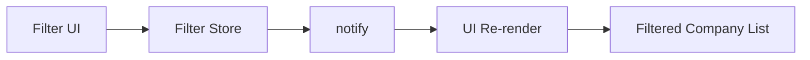
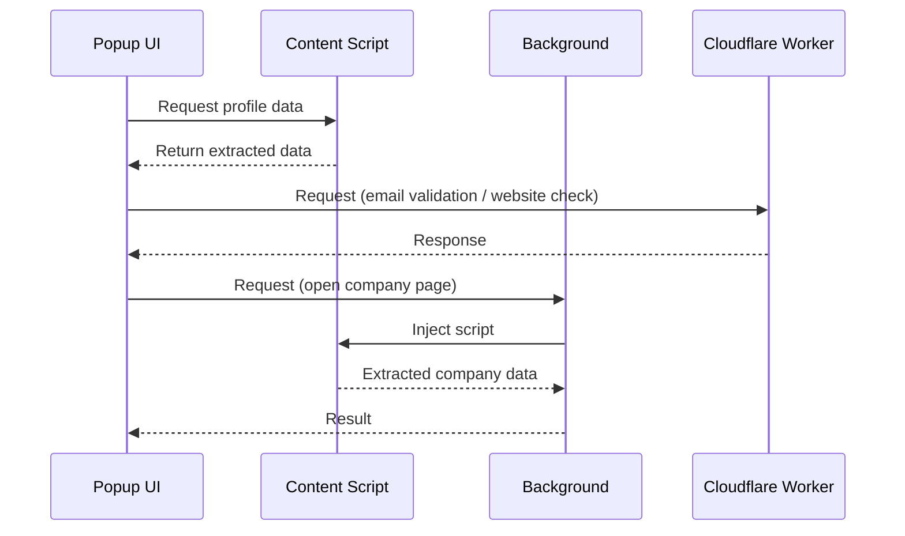
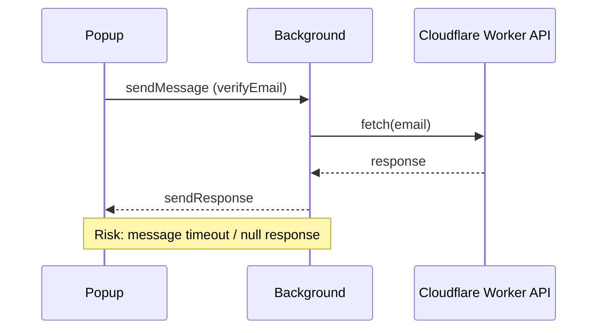

# Architecture Overview – Lead Generator Extension

**Last updated**: April 28, 2026

This document provides a high-level overview of the architectural structure of the **Lead Generator** Chrome Extension. It is intended for developers and maintainers who wish to understand how the extension is structured and how its core components interact.

## 1. Overview

The extension is designed to extract structured data (name, surname, job position, LinkedIn profile link, etc.) from:

- **LinkedIn Sales Navigator pages** (`https://www.linkedin.com/sales/lead/*`, `https://www.linkedin.com/sales/company/*`)
- **LinkedIn company pages** (`https://www.linkedin.com/company/*`)

The extension operates **only within LinkedIn domains** (`https://www.linkedin.com/*`).

Due to modern browser security restrictions (CORS), all external network requests are performed via a **secure backend (Cloudflare Worker)**.

The extension is composed of modular JavaScript files, grouped logically into directories. These files operate in two main environments:

- **Content Scripts** – run inside LinkedIn pages
- **Extension UI Scripts (Popup)** – handle user interaction and UI logic

## 2. Key Components

### 2.1 Content Scripts (`src/content-scripts`)

- Injected into:
  - `https://www.linkedin.com/sales/lead/*`
  - `https://www.linkedin.com/sales/company/*`
  - `https://www.linkedin.com/company/*`
- Responsible for extracting public data from the DOM via messaging
- Do **not perform external network requests**
- Examples: `lead.js`, `lead-experience.js`

### 2.2 Extension Scripts (`src/scripts`)

Contain all logic related to:

- UI rendering
- State management
- User interaction
- Direct communication with backend services

#### ▸ `src/scripts/worker/` (background.js)

Used **only when necessary** for:

- Chrome APIs:
  - `tabs`
  - `scripting`
- Managing background tab processing (e.g., opening company pages)
- Coordinating data extraction from secondary pages

🚫 **Not used for external HTTP requests**

#### ▸ `src/scripts/containers/data/`

Handles user-interaction logic related to core actions:

- `extract-data.js` – fetches and formats the data from the LinkedIn page when the "Extract" button is clicked
- `copy-data.js` – copies the collected data to the clipboard

### 2.3 Filters (`src/scripts/filters`)

The filtering system is implemented as a **client-side module** responsible for dynamically filtering extracted company data within the popup UI.

#### Key Characteristics

- Fully **client-side** (no backend involvement)
- Works on already extracted data (no additional DOM queries)
- Designed as a **reactive system** using a lightweight state manager

#### Structure

- `filter-store.js` – centralized state management
- `location-filter.js` – handles location filtering UI and logic
- `location-size.js` – handles size filtering UI and logic

#### UI Behavior

- Multi-select dropdown with **tag-based selection**
- Selected values are displayed as removable tags
- Removing a tag reintroduces the option into the dropdown

#### Filtering Logic

- Supports **combined filtering (AND logic)**
  - Example:
    - Location = "Germany"
    - Size = "51-200"
    → Only items matching both conditions are displayed

#### State Management

The filtering system is powered by a **custom mini state manager**, which provides:

- Centralized state (`state`)
- Subscription mechanism (`subscribe`)
- Reactive updates (`notify`)

This allows UI components to automatically re-render when filters change.

#### Persistence

- Filter state is persisted using **Chrome Storage API**
- Restored on extension load



### 2.4 Backend (Cloudflare Worker)

A critical part of the architecture.

Handles:

- Email validation (via Emailable API)
- Website availability checks
- Cross-origin requests (CORS-safe proxy)

All external requests go through: [Cloudflare Worker](https://developers.cloudflare.com/workers/)

### 2.5 Styles (`src/styles`)

- `main.css` defines styles for the popup interface and interactive components

### 2.6 HTML Interface

- `index.html` is located at the root and serves as the popup's main container

### 2.7 UI Architecture

The extension UI follows a lightweight SPA-like approach within the popup.

- The **left panel** is static and always visible
- The **right panel** is dynamic and controlled via a tab system

#### Tab System

- Implemented using a **dropdown selector**
- Tabs are rendered using a **show/hide pattern (no full re-render)**
- Current tabs:
  - **Actual Experience** (default) – displays extracted company data
  - **Filters** – allows filtering extracted company data
  - **Settings** – manages user preferences

This approach avoids unnecessary DOM re-creation and improves performance within the constrained popup environment.

## 3. Technologies Used

- **Vanilla JavaScript** – no front-end frameworks are used
- **Chrome Extension APIs** – used for background workers, clipboard operations, and storage
- **OAuth2 (Google)** – used for authenticated access to Google Translate API during translations
- **Chrome Storage API** – used to persist user preferences (e.g., drag-and-drop, individual's names transliteration settings)
- **Cloudflare Workers (Backend layer)** - used for handling external requests and cross-origin operations

## 4. Third-Party Services

### 4.1 Emailable API

- Used for email verification
- Accessed only via secure backend (Cloudflare Worker)

### 4.2 Google Cloud Translate API

- Optional
- Used to translate non-English job titles into English
- Requires Google account authentication via OAuth2
- Translation is performed client-side during the session

## 5. Security & Privacy Considerations

- **No personal or extracted profile data is stored**
- **User preferences (UI settings)** are stored locally using Chrome Storage API
- **No cookies are set or read**
- **Clipboard is used only temporarily**, initiated manually by the user
- **OAuth2 tokens** for Google Translate are handled by the Chrome Identity API and never stored
- **All secret keys (Emailable API)** are stored only in the Cloudflare Worker

For more, see [PRIVACY_POLICY.md](../PRIVACY_POLICY.md)

## 5. Project Structure

```src/
 ├── content-scripts/
 │    ├── actions/
 │    ├── common/
 │    ├── linkedin-pages/
 │    ├── sale-navigator-pages/
 │          ├── company/
 │          ├── lead/
 ├── scripts/
 │    ├── containers/
 │          ├── data/
 │          ├── experience/
 │          ├── filters/
 │          ├── navigation/
 │          ├── settings/
 │    ├── feature/
 │    ├── helper/
 │    ├── output/
 │    ├── services/
 │    ├── store/
 │    ├── worker/
 ├── styles/
 └── utils/
 ```

## 6. Data Flow Summary

1. User opens the popup

2. On pressing "Extract", content scripts extract data from the current `https://www.linkedin.com/sales/lead/*` LinkedIn Sales Navigator page and `https://www.linkedin.com/sales/company/*`, `https://www.linkedin.com/company/*` in the background mode

3. Data is returned and displayed in the popup

4. The user can:
   - Copy the data via the "Copy" button
   - Rearrange data using drag-and-drop
   - Translate job title via the Google Translate API (if logged in via Google OAuth2)
   - Trigger email generation:
     - Extension sends company domain to backend
     - Backend validates generated emails via Emailable
     - Valid result is returned and inserted into form and clipboard
   - Validate email separately via Emailable

5. No data is stored on servers; data only exists temporarily in memory or clipboard

6. The user can configure extension behavior via the Settings tab:
   - Toggle drag-and-drop functionality
   - Toggle individual's names transliteration
   - Preferences are persisted using Chrome Storage API
   - Apply filters:
     - Filter state is updated via the filter store
     - UI automatically re-renders based on active filters
     - Filtering is performed entirely in memory (no additional requests)



## 7. Permissions Summary

```json
"permissions": [
  "activeTab",
  "scripting",
  "identity",
  "tabs",
  "storage"
],
"host_permissions": [
  "https://www.linkedin.com/sales/lead/*",
  "https://www.linkedin.com/sales/company/*",
  "https://www.linkedin.com/company/*",
  "https://lead-generator-backend-worker.vitalij-musko.workers.dev"
]
```

## 8. Extensibility Notes

The modular directory structure allows easy scaling:

- New button logic can be added inside `containers/data/`
- Background tasks can be isolated under `worker/`
- Any new content scripts should go under `content-scripts/`
- The tab-based UI allows easy addition of new functional modules
- New tabs can be added without restructuring the core layout
- New filters can be added inside `filters/` using the same pattern:
  - UI module + state integration via filter-store
- The filter system is designed to support scalable multi-criteria filtering

## 9. Background Script Usage Strategy

In the current architecture of the extension, the `background.js` (service worker) is **used selectively** and only for scenarios where it provides clear technical value.

### 9.1 When Background Script Is Used

The background service worker is responsible for:

- Handling tasks that require **Chrome Extension APIs**, such as:
  - tab interaction (`tabs`)
  - script injection (`scripting`)
- Executing **centralized logic** that must persist independently of the popup lifecycle

### 9.2 When Background Script Is NOT Used

For simple network operations (e.g., HTTP requests to external APIs), the extension **avoids using the background script as a proxy layer**.

Instead, such requests are executed **directly from the popup (UI layer)** when the following conditions are met:

- The request does not require Chrome-specific APIs
- No sensitive data (e.g., API keys) is exposed in the client
- The external service is already protected via a secure backend (e.g., Cloudflare Worker)

### 9.3 Rationale

Avoiding the background script in these cases improves both **stability** and **performance**.

#### ❗ Limitations of Chrome Messaging

Communication between the popup and background relies on `chrome.runtime.sendMessage`, which has an **implicit timeout and lifecycle constraints**:

- If an asynchronous operation (e.g., `fetch`) takes too long
  - the message channel may close prematurely
  - the popup receives a `null` response
- This behavior is especially common under network latency or high load

#### ⚠️ Service Worker Lifecycle (Manifest V3)

In Manifest V3, the background script runs as a **service worker**, which:

- Can be **terminated at any time**
- Does not guarantee completion of long-running async operations
- May interrupt pending requests or responses

### 9.4 Architecture Comparison

#### ❌ Legacy (Problematic) Approach



### 9.5 Benefits of Direct Fetch from Popup

Using direct fetch calls from the popup provides:

- Reliable async behavior (async/await works without interruption)
- No dependency on message passing or channel timeouts
- Lower latency (no intermediate layer)
- Simpler and more maintainable code
- Improved user experience (fewer edge-case failures)


### 9.6 Request Stability Improvements

The background communication layer has been improved to ensure more reliable data fetching:

- Introduced better handling of asynchronous message flows
- Reduced race conditions when multiple requests are triggered rapidly (e.g., switching between companies)
- Improved resilience against message timeouts in Chrome's service worker environment

These improvements enhance overall data consistency and user experience without introducing additional complexity to the UI layer.

### 9.7 Summary

The background script is **not a default communication layer**, but a **specialized tool**.

> It should only be used when its capabilities are required. Otherwise, introducing it into the request flow may lead to unnecessary complexity, reduced reliability, and degraded user experience.

## 10. Related Documents

- [`README.md`](../README.md) – Installation and usage instructions
- [`PRIVACY_POLICY.md`](../PRIVACY_POLICY.md) – Explains what data is collected and how it is handled
- [`CHANGELOG.md`](../CHANGELOG.md) – List of version changes
